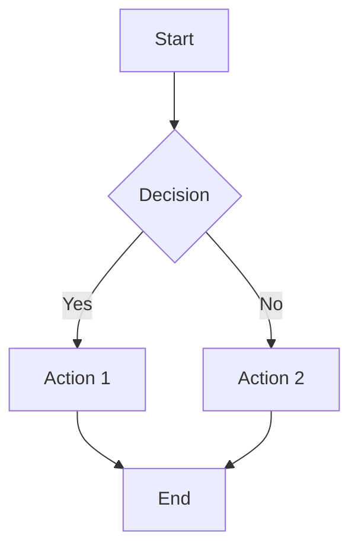
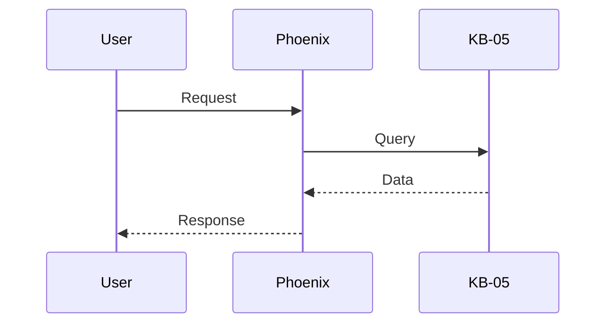
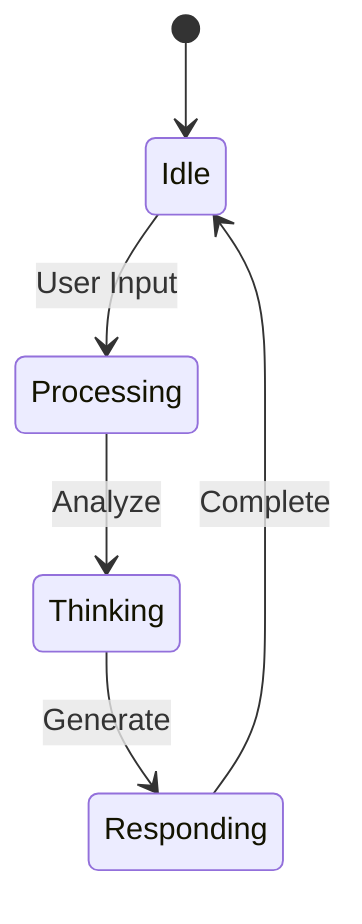

# 🎨 Visual Cognition: PaperBanana Integration for Phoenix Marie

## Overview

Phoenix Marie now has **Visual Cognition** capabilities, inspired by the PaperBanana architecture. This feature enables Phoenix to generate interactive, high-resolution diagrams that are rendered locally on the client, maintaining the "Bare Metal" sovereignty promise.

## Architecture

### Backend (Rust)

#### 1. Visual Cognition Skill
**Location**: [`crates/pagi-skills/src/visual_cognition.rs`](crates/pagi-skills/src/visual_cognition.rs)

The Visual Cognition skill intercepts LLM output and identifies diagram blocks (Mermaid, Graphviz DOT, etc.), wrapping them in structured JSON envelopes for frontend rendering.

**Key Features**:
- Detects ````mermaid` and ````dot` code blocks
- Wraps diagrams in JSON envelopes with metadata
- Stores diagrams in KB-05 (Architectural Memory) for persistence
- Supports multiple diagram formats

**JSON Envelope Format**:
```json
{
  "type": "diagram",
  "format": "mermaid",
  "content": "graph TD\n    A --> B",
  "metadata": {
    "created_at": "2026-02-11T09:00:00Z",
    "kb_key": "sovereign_stack_architecture",
    "title": "Sovereign Stack Overview"
  }
}
```

#### 2. System Prompt Enhancement
**Location**: [`add-ons/pagi-gateway/src/knowledge_router.rs`](add-ons/pagi-gateway/src/knowledge_router.rs)

The system prompt now includes comprehensive instructions for diagram generation, teaching Phoenix when and how to create visual representations.

**Capabilities**:
- Flowcharts (`graph TD`, `graph LR`)
- Sequence diagrams (`sequenceDiagram`)
- State diagrams (`stateDiagram-v2`)
- Class diagrams (`classDiagram`)
- Entity relationships (`erDiagram`)
- Gantt charts (`gantt`)

### Frontend (React/TypeScript)

#### 1. DiagramViewer Component
**Location**: [`add-ons/pagi-studio-ui/assets/studio-interface/components/DiagramViewer.tsx`](add-ons/pagi-studio-ui/assets/studio-interface/components/DiagramViewer.tsx)

A sophisticated React component that renders Mermaid diagrams as interactive SVG with zoom/pan capabilities.

**Features**:
- **Local-Only Rendering**: All diagram generation happens on the client using Mermaid.js
- **Interactive Controls**: Zoom in/out, reset, fullscreen mode
- **Export Capability**: Download diagrams as SVG files
- **Dark Theme**: Matches Phoenix's aesthetic
- **Metadata Display**: Shows creation time and KB-05 storage key

#### 2. ChatInterface Integration
**Location**: [`add-ons/pagi-studio-ui/assets/studio-interface/components/ChatInterface.tsx`](add-ons/pagi-studio-ui/assets/studio-interface/components/ChatInterface.tsx)

The chat interface now automatically detects diagram envelopes in message content and renders them using the DiagramViewer component.

**Parser Logic**:
- Scans message content for JSON diagram envelopes
- Extracts diagrams and separates them from text content
- Renders diagrams inline with messages
- Supports multiple diagrams per message

## Usage

### For Users

Simply ask Phoenix to visualize something:

```
"Show me how the 8 Knowledge Bases interact"
"Draw a diagram of the Sovereign Stack architecture"
"Visualize the authentication flow"
"Map out my local network infrastructure"
```

Phoenix will respond with an interactive diagram that you can:
- Zoom in/out for detail
- View in fullscreen
- Download as SVG for documentation
- Reference later (stored in KB-05)

### For Developers

#### Creating Diagrams in Code

```rust
use pagi_skills::VisualCognitionSkill;

let skill = VisualCognitionSkill::new();
let payload = serde_json::json!({
    "content": "```mermaid\ngraph TD\n    A --> B\n```",
    "store_key": "my_diagram"
});

let result = skill.execute(&ctx, Some(payload)).await?;
```

#### Mermaid Syntax Examples

**Flowchart**:


**Sequence Diagram**:


**State Diagram**:


## KB-05 Integration

Diagrams are automatically stored in KB-05 (Architectural Memory) when a `store_key` is provided. This allows Phoenix to:

1. **Remember System Architecture**: Store and update architectural diagrams over time
2. **Reference Past Visualizations**: Recall previously generated diagrams
3. **Track Evolution**: See how system designs change
4. **Build Knowledge**: Create a visual knowledge base

**Storage Format**:
```
Key: diagram:mermaid:sovereign_stack_architecture
Value: { "type": "diagram", "format": "mermaid", ... }
```

## Sovereignty & Security

### Local-Only Rendering
All diagram rendering happens **locally on the client** using Mermaid.js. No data is sent to external services for visualization.

### Security Configuration
Mermaid is initialized with `securityLevel: 'strict'` to prevent:
- External resource loading
- XSS attacks
- Data exfiltration

### Bare Metal Promise
This feature maintains Phoenix's "Bare Metal" sovereignty:
- ✅ No external API calls for rendering
- ✅ No cloud dependencies
- ✅ All processing happens on your machine
- ✅ Diagrams stored locally in KB-05

## Installation

### Backend Dependencies
Already included in `pagi-skills` crate:
- `serde` for JSON serialization
- `chrono` for timestamps
- `async-trait` for async skill execution

### Frontend Dependencies
Add to [`package.json`](add-ons/pagi-studio-ui/assets/studio-interface/package.json):
```json
{
  "dependencies": {
    "mermaid": "^11.4.1"
  }
}
```

Install:
```bash
cd add-ons/pagi-studio-ui/assets/studio-interface
npm install
```

## Testing

### Manual Testing
1. Start Phoenix: `./phoenix-rise.ps1` (Windows) or `./phoenix-rise.sh` (Unix)
2. Open the Studio UI
3. Ask Phoenix: "Draw me a diagram of the current Sovereign Stack"
4. Verify the diagram renders correctly
5. Test zoom/pan controls
6. Download the SVG and verify it opens correctly

### Automated Testing
Run the skill tests:
```bash
cargo test -p pagi-skills visual_cognition
```

## Future Enhancements

### Planned Features
1. **Graphviz DOT Support**: Full rendering of DOT diagrams
2. **PlantUML Integration**: Support for PlantUML syntax
3. **Diagram Editing**: Allow users to modify diagrams in-place
4. **Version Control**: Track diagram changes over time in KB-05
5. **Export Formats**: PNG, PDF, and other formats
6. **Collaborative Diagrams**: Multi-user diagram editing
7. **AI-Assisted Layout**: Phoenix suggests optimal diagram layouts

### Research Areas
- **3D Visualizations**: WebGL-based 3D architecture diagrams
- **Real-Time Updates**: Live diagram updates as systems change
- **Diagram Diffing**: Visual comparison of diagram versions
- **Natural Language to Diagram**: Direct conversion of descriptions to diagrams

## Comparison to PaperBanana

| Feature | PaperBanana | Phoenix Visual Cognition |
|---------|-------------|--------------------------|
| Rendering | External API | Local (Mermaid.js) |
| Formats | LaTeX, Mermaid | Mermaid, DOT (planned) |
| Storage | Ephemeral | KB-05 (persistent) |
| Sovereignty | Cloud-dependent | Fully local |
| Interactivity | Static | Zoom/Pan/Fullscreen |
| Export | Limited | SVG download |

## Troubleshooting

### Diagram Not Rendering
1. Check browser console for Mermaid errors
2. Verify Mermaid syntax is valid
3. Ensure `mermaid` package is installed
4. Check that the JSON envelope is properly formatted

### TypeScript Errors
If you see "Cannot find module 'mermaid'":
```bash
cd add-ons/pagi-studio-ui/assets/studio-interface
npm install
```

### Diagram Too Small/Large
Use the zoom controls in the DiagramViewer component, or adjust the `zoom` state in the component.

## Contributing

To add support for new diagram formats:

1. Update [`visual_cognition.rs`](crates/pagi-skills/src/visual_cognition.rs) to detect the new format
2. Add rendering logic to [`DiagramViewer.tsx`](add-ons/pagi-studio-ui/assets/studio-interface/components/DiagramViewer.tsx)
3. Update the system prompt in [`knowledge_router.rs`](add-ons/pagi-gateway/src/knowledge_router.rs)
4. Add tests and documentation

## Credits

Inspired by the **PaperBanana** architecture, which pioneered the concept of LLM-generated structured visualizations. Phoenix's implementation extends this with:
- Full local sovereignty
- Persistent storage in KB-05
- Interactive controls
- Integration with the 8-KB knowledge system

---

**Phoenix Marie** - *"I don't just tell you how systems work. I show you."*
